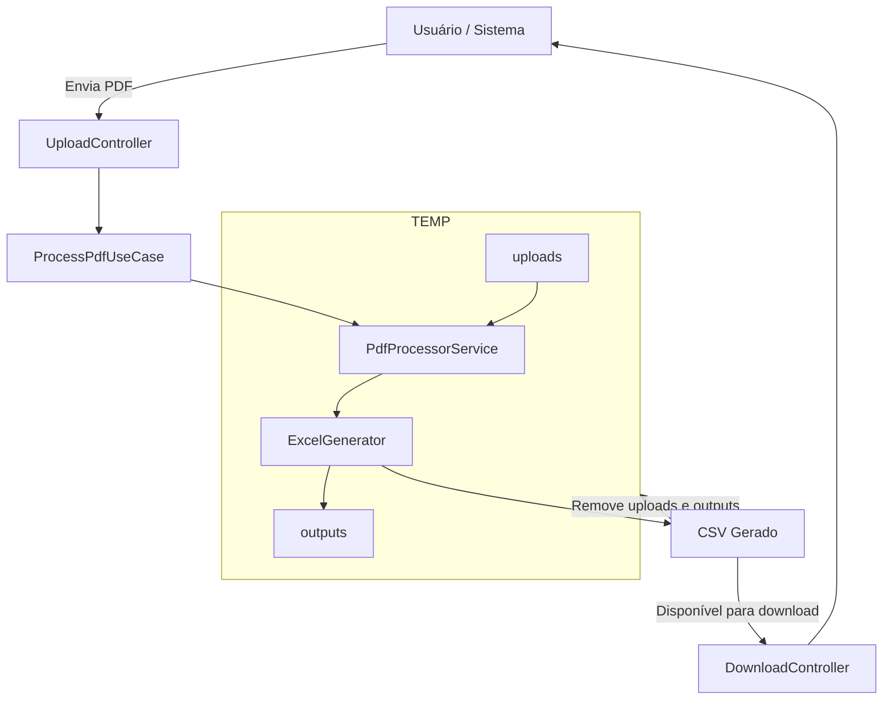

# 📄 PDF → CSV API for Domínio Accounting System

Automatically convert Brazilian tax payment receipts (DARF/DAS) from PDF into a CSV file ready to import into the Domínio accounting system.

This README is split for two audiences:
- Non-technical: simple overview, how to use, and visuals
- Technical: how to run, endpoints, architecture, and notes

---

## 👀 For non-technical users

### What this API does
- Receives a payment receipt PDF (DARF/DAS)
- Extracts the necessary information
- Generates a CSV file ready for Domínio
- Allows you to download the generated file

### How to use (step by step)
1) Open the system that uses this API (or ask your technical contact to run the API locally)
2) Send the PDF using the “Upload PDF” option
3) Wait for processing to finish
4) Download the generated CSV and import it into Domínio

### Visual example

- Upload page (choose the PDF to process):
  
  Description: Screen where you select and send the PDF file for processing.

- Short demo video (full flow):
  [Watch the demo](./videos/eb778703-c0cf-44cf-ac5e-37d5a47698c0.gif)
  Description: Demonstrates uploading the PDF and downloading the CSV.

---

## 🧑‍💻 For technical users

### Run locally

Requirements:
- Node.js 18+

Commands:
- Install dependencies:
  npm install
- Run in development:
  npm run dev
- Build and run in production:
  npm run build && npm start

By default, the server runs at http://localhost:3000.

### API Endpoints

#### 📤 POST /api/upload
Uploads a PDF for processing.

Headers:
- Content-Type: multipart/form-data

Form fields:
- pdfFile (file) required – the payment receipt PDF (DARF/DAS)

Example cURL:
 curl -X POST \
  -F "pdfFile=@/full/path/to/your-file.pdf" \
  http://localhost:3000/api/upload

Successful response (200):
{
  "result": {
    "message": "Processing finished",
    "outputPath": "outputs/relatorio.csv"
  }
}

Common errors:
- 400 { "message": "File not provided." }
- 500 { "message": "Failed to process PDF", "error": { ... } }

#### 📥 GET /api/download
Downloads the last generated CSV.

Response:
- Content-Type: text/csv
- Content-Disposition: attachment
- 404 if there is no file available

Example cURL:
 curl -O http://localhost:3000/api/download

---

### How it works (high level)

- UploadController triggers ProcessPdfUseCase
- PdfProcessorService reads and interprets the PDF
- ExcelGenerator creates a CSV with the following headers (kept in Portuguese for Domínio compatibility):
  dataDeArrecadacao;debito;credito;total;descricao;divisao
- For each item two rows are generated:
  - 1 with the debit value
  - 1 with the fixed credit value = 5

After downloading the CSV, the uploads/ and outputs/ folders are cleaned up.

#### Flow diagram



### Project structure

src/
├── application/use-cases/process-pdf/
│   ├── ProcessPdfCommand.ts
│   └── ProcessPdfUseCase.ts
├── domain/services/
│   ├── PdfProcessorService.ts
│   └── fileService.ts
├── infrastructure/
│   ├── controllers/
│   │   ├── UploadController.ts
│   │   └── downloadController.ts
│   ├── middlewares/
│   │   └── uploadMiddleware.ts
│   └── routes/
│       ├── uploadRoutes.ts
│       └── downloadRoutes.ts
├── shared/utils/
│   ├── ExcelGenerator.ts
│   └── pdfUtilsHistoryFormat.ts
└── shared/logging/
    └── logger.ts
```

### Main dependencies
- express
- multer
- pdf-parse
- exceljs

### Sample generated CSV
08/01/2024;191;;145,20;PG. INSS XX;1

08/01/2024;;5;;145,20;PG. INSS XX;

Notes:
- Header names and field separators are aligned to the expected Domínio import format.
- The decimal separator in examples may appear as a comma depending on locale.

### Important notes
- After download, the CSV and original PDF are automatically removed
- Only the last processed file is kept temporarily
- Ensure the application has write permissions to uploads/ and outputs/

---

## 🧱 Simple roadmap (optional)
- PDF layout validation (rules per document type)
- History of processed files
- Authentication and file size limits
- Additional export to XLSX

---

## This project showcases
- Node.js / Express
- PDF upload and parsing
- CSV generation (exceljs)
- Modular architecture
- Middlewares and controllers
- Clean architecture (application, domain, infrastructure)
- Logging
- File handling (multer)
- API best practices

## Built 100% by me, including
- Architecture
- API implementation
- PDF processing
- CSV generator
- Documentation and demo

## 📄 License
Distributed under the MIT License. See the LICENSE file.
